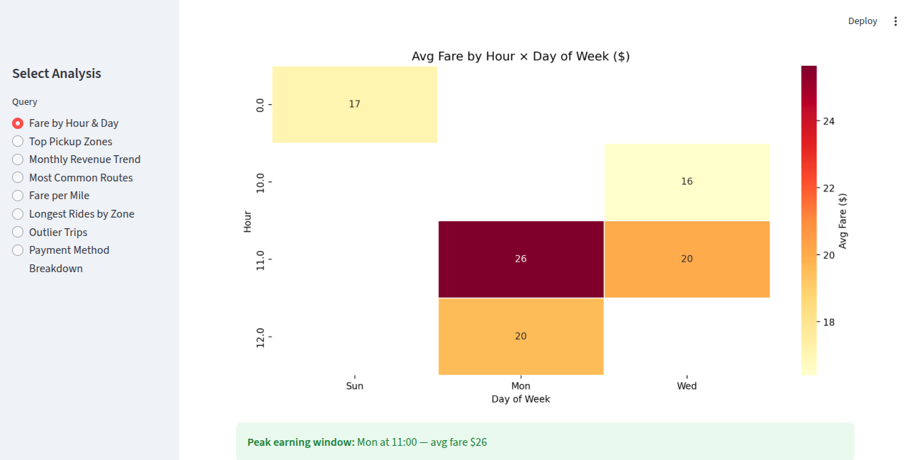
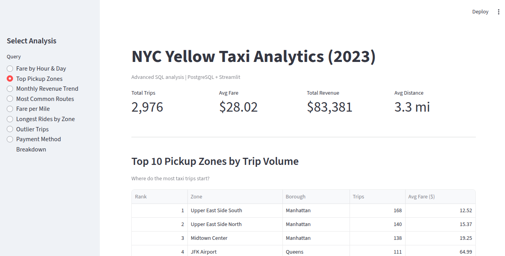
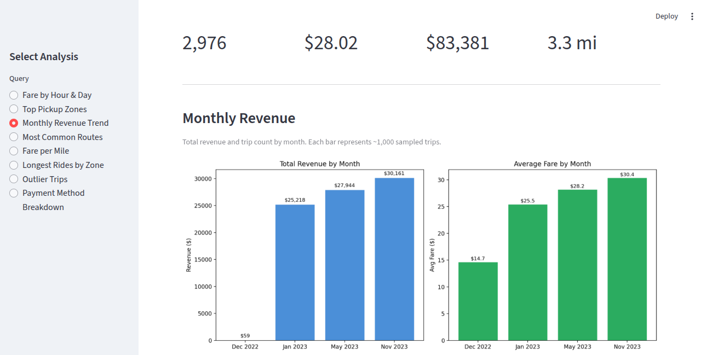

# NYC Yellow Taxi SQL Analytics

> Advanced SQL analysis of NYC Yellow Taxi trip data. Answers 8 business questions using window functions, CTEs, conditional aggregation, and statistical outlier detection.

 |  | 

---

## Problem

NYC's Taxi and Limousine Commission publishes hundreds of millions of trip records per year. While the raw data is publicly available via the Socrata API, extracting actionable insights requires sophisticated SQL. This project demonstrates **advanced SQL techniques** applied to a real-world dataset to answer concrete business questions a taxi operator or city planner would care about.

---

## Business Questions Answered

| # | Question | SQL Technique Demonstrated |
|---|----------|---------------------------|
| 1 | When are fares highest? (hour × day) | `EXTRACT()`, `GROUP BY`, `HAVING` |
| 2 | Top 10 busiest pickup zones | `RANK()` window function + `JOIN` |
| 3 | Monthly revenue & average fare trend | `date_trunc()`, `SUM()`, `AVG()` |
| 4 | Most common routes (pickup → dropoff) | Multi-column `GROUP BY` + dual `JOIN` |
| 5 | Fare rate by trip distance bucket | `CASE WHEN` bucketing + `PERCENTILE_CONT` |
| 6 | Longest average rides by zone | `EXTRACT(EPOCH FROM interval)`, `RANK()` |
| 7 | Statistically abnormal fares (outliers) | Subquery + 3-sigma rule |
| 8 | Revenue & fare by payment method | CTEs + conditional aggregation + `SUM() OVER()` |

---

**Data flow:**
`Socrata API → Python loader (offset sampling) → Postgres (raw + zones) → SQL queries → Streamlit (charts + tables)`

---

## Tech Stack

| Layer | Technology | Purpose |
|-------|-----------|---------|
| Database | PostgreSQL 15 (Docker) | Storage + query engine |
| Data Source | NYC Open Data (Socrata SODA API) | 2023 Yellow Taxi trips |
| Ingestion | Python `requests` + `psycopg2` | API → Postgres loader |
| Analysis | Advanced SQL (window functions, CTEs) | All 8 analytical queries |
| Visualization | Streamlit + Matplotlib + Seaborn | Interactive dashboard |
| Infrastructure | Docker Compose | Reproducible Postgres container |


## Setup

### Prerequisites

- Python 3.10+
- [Docker Desktop](https://www.docker.com/products/docker-desktop/)
- ~1 GB free disk space

Clone & Install

```bash
git clone https://github.com/YOUR_USERNAME/nyc-taxi-analytics.git
cd nyc-taxi-analytics

pip install -r requirements.txt   

2. Start PostgreSQL
docker compose up -d

3. Load Data
python3 load_data.py

This pulls ~3,000 rows from the NYC Open Data API (offset-sampled across Jan, May, Nov 2023) and loads them into Postgres along with the 263-zone lookup table. Takes ~2 minutes.

4. Run the Dashboard
cd streamlit_app
streamlit run app.py

Open http://localhost:8501. Use the sidebar to switch between the 8 analyses.

5. (Optional) Run SQL Queries Directly

docker cp sql/02_analysis.sql nyc_taxi_postgres:/tmp/
docker exec -it nyc_taxi_postgres psql -U taxi_user -d taxi -f /tmp/02_analysis.sql   


Data Source

| Field | Detail |
|-------|--------|
| Dataset | [NYC Yellow Taxi Trip Records 2023](https://data.cityofnewyork.us/Transportation/2023-Yellow-Taxi-Trip-Data/4b4i-vvec) |
| Zone Lookup | [Taxi Zone Lookup Table](https://data.cityofnewyork.us/City-Government/Taxi-Zone-Lookup-Table/8meu-9t5y) |
| API | Socrata SODA (no API key required) |
| Volume | ~3,000 rows (offset-sampled from ~50M total) |
| Months | January, May, November 2023 |


SQL Techniques Demonstrated
Window Functions

-- RANK() for top-N zones
RANK() OVER (ORDER BY COUNT(*) DESC) AS pickup_rank

-- SUM() OVER() for percentage-of-total
ROUND(revenue * 100.0 / SUM(revenue) OVER (), 1) AS revenue_pct   

CTEs (Common Table Expressions)
-- WITH monthly_revenue AS (
    SELECT date_trunc('month', pickup_datetime) AS month,
           SUM(total_amount) AS revenue
    FROM yellow_taxi_2023 GROUP BY 1
)
SELECT *, LAG(revenue) OVER (ORDER BY month) AS prev_month FROM monthly_revenue;

Conditional Aggregation (PIVOT-style)
-- ROUND(SUM(total_amount) * 100.0 / SUM(SUM(total_amount)) OVER (), 1) AS revenue_pct

Statistical Outlier Detection
-- WITH stats AS (
    SELECT AVG(total_amount) AS mean_f, STDDEV(total_amount) AS std_f
    FROM yellow_taxi_2023
)
SELECT * FROM yellow_taxi_2023 t, stats
WHERE t.total_amount > stats.mean_f + 3 * stats.std_f;

Type Casting
-- ROUND(PERCENTILE_CONT(0.5) WITHIN GROUP (ORDER BY total_amount)::numeric, 2)
--      ^^^^^^^^^^^^^^^^^^ returns double precision, must cast to numeric for ROUND()


| Decision | Rationale |
|----------|-----------|
| **Offset sampling (not `$where`)** | Socrata's free API ignores `$where` on large datasets; offset-based sampling reliably spreads data across the year |
| **3,000 rows (not full 50M)** | Fast enough for local Postgres; demonstrates identical SQL patterns at any scale |
| **Port 6544** | Avoids conflict with the NYC 311 project (port 6543) |
| **SQL in separate `.sql` file** | Shows standalone analytical queries (what analysts write daily in DBeaver/psql) |
| **Zone JOIN in queries** | Human-readable output ("JFK Airport" not "132") — what a stakeholder actually wants to see |
| **Payment code mapping** | "Credit Card" not "1" — dashboard should be readable by non-technical users |
| **`HAVING COUNT(*) >= 5`** | Filters out noise from low-sample cells (e.g., 1 trip at 5 AM on a Tuesday) |
| **Local-only deployment** | SQL analytics projects are judged on the queries, not the web app; avoids the complexity of cloud DB hosting |


   
   
